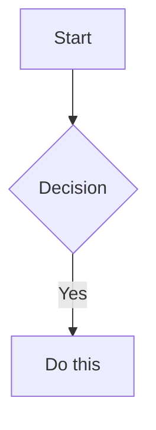

# SoundBrain - Project Skills

This document lists all available Claude Code skills installed for this project.

---

## 📦 Available Skills

| Skill | Purpose | Key Commands |
|-------|---------|--------------|
| `banana` | AI Image Generation Creative Director | `/banana generate`, `/banana edit`, `/banana chat`, `/banana inspire` |
| `obsidian-markdown` | Obsidian Flavored Markdown documentation | wikilinks `[[]]`, callouts `> [!note]`, embeds `![[]]` |
| `mobile-design` | Mobile-first design thinking | React Native, Flutter, touch UX, Fitts' Law |
| `senior-architect` | Software architecture & system design | architecture patterns, tech decisions, diagrams |
| `ui-ux-pro-max` | UI/UX design intelligence | 50 styles, 21 palettes, 9 stacks |
| `senior-prompt-engineer` | LLM & prompt optimization | agents, RAG, evaluation frameworks |
| `code-reviewer` | Automated code analysis | `code_quality_checker`, `pr_analyzer`, `review_report_generator` |

---

## 🍌 Banana - AI Image Generation Creative Director

**Author:** AgriciDaniel
**Version:** 1.4.1
**Package:** `@ycse/nanobanana-mcp`

### Commands

| Command | Description |
|---------|-------------|
| `/banana generate <idea>` | Full prompt engineering pipeline for image generation |
| `/banana edit <path> <instructions>` | Intelligent image editing |
| `/banana chat` | Multi-turn visual session with consistent style |
| `/banana inspire [category]` | Browse 2,500+ prompt database |
| `/banana batch <idea> [N]` | Generate N variations (default: 3) |
| `/banana setup` | Configure MCP server and API key |
| `/banana preset [list|create|show|delete]` | Manage brand/style presets |
| `/banana cost [summary|today|estimate]` | View cost tracking |

### Domain Modes

- **Cinema** - Dramatic scenes, storytelling, mood pieces
- **Product** - E-commerce, packshots, merchandise
- **Portrait** - People, characters, headshots, avatars
- **Editorial** - Fashion, magazine, lifestyle
- **UI/Web** - Icons, illustrations, app assets
- **Logo** - Branding, marks, identity
- **Landscape** - Environments, backgrounds, wallpapers
- **Abstract** - Patterns, textures, generative art
- **Infographic** - Data visualization, diagrams, charts

### Setup

```bash
python3 .claude/skills/banana/scripts/setup_mcp.py
```

**Requires:** Node.js 18+, Google AI API key (https://aistudio.google.com/apikey)

### Reference Files

- `references/gemini-models.md` - Model specs and parameters
- `references/prompt-engineering.md` - 5-component formula
- `references/mcp-tools.md` - MCP tool documentation
- `references/post-processing.md` - FFmpeg/ImageMagick pipelines
- `references/cost-tracking.md` - Pricing and limits
- `references/presets.md` - Brand preset management

---

## 📝 Obsidian Markdown - Documentation Skill

**Use When:** Creating .md files in Obsidian, using wikilinks, callouts, embeds, frontmatter, tags.

### Key Features

#### Wikilinks (Internal Links)
```markdown
[[Note Name]]
[[Note Name|Display Text]]
[[Note Name#Heading]]
[[Note Name#^block-id]]
```

#### Embeds
```markdown
![[Note Name]]
![[image.png|300]]
![[audio.mp3]]
![[document.pdf#page=3]]
```

#### Callouts
```markdown
> [!note]
> Blue, pencil icon

> [!tip]+ Collapsed by default
> Hidden until expanded
```

Callout types: `note`, `abstract`, `info`, `todo`, `tip`, `success`, `question`, `warning`, `failure`, `danger`, `bug`, `example`, `quote`

#### Properties (Frontmatter)
```yaml
---
title: My Note
date: 2024-01-15
tags:
  - project
  - active
aliases:
  - Alternative Name
status: in-progress
---
```

#### Tasks
```markdown
- [ ] Incomplete task
- [x] Completed task
```

### Diagrams (Mermaid)
```markdown

```

---

## 📱 Mobile Design - Mobile-First Design Thinking

**Philosophy:** Touch-first. Battery-conscious. Platform-respectful. Offline-capable.

### Critical Rules

| ❌ NEVER DO | ✅ ALWAYS DO |
|-------------|--------------|
| ScrollView for long lists | FlatList/FlashList with memo |
| Inline renderItem function | useCallback + React.memo |
| Missing keyExtractor | Stable unique ID |
| Touch target < 44px | Minimum 44pt (iOS) / 48dp (Android) |
| Token in AsyncStorage | SecureStore/Keychain |
| console.log in production | Remove before release |

### Platform Decision Matrix

| Element | iOS | Android |
|---------|-----|---------|
| **Primary Font** | SF Pro | Roboto |
| **Min Touch Target** | 44pt × 44pt | 48dp × 48dp |
| **Back Navigation** | Edge swipe | System back button |
| **Icons** | SF Symbols | Material Symbols |

### Files to Read (MANDATORY)

| File | Content |
|------|---------|
| `mobile-design-thinking.md` | ⚠️ ANTI-MEMORIZATION - Forces thinking |
| `touch-psychology.md` | Fitts' Law, gestures, thumb zone |
| `mobile-performance.md` | RN/Flutter performance, 60fps |
| `mobile-backend.md` | Push notifications, offline sync |
| `platform-ios.md` | HIG, SF Pro, SwiftUI patterns |
| `platform-android.md` | Material Design 3, Compose |

### Scripts

```bash
# Mobile UX & Touch Audit
python scripts/mobile_audit.py <project_path>
```

---

## 🏗️ Senior Architect - Software Architecture

**Use When:** Designing system architecture, making technical decisions, creating diagrams.

### Core Scripts

```bash
# Architecture Diagram Generator
python scripts/architecture_diagram_generator.py [options]

# Project Architect
python scripts/project_architect.py [options]

# Dependency Analyzer
python scripts/dependency_analyzer.py [options]
```

### Tech Stack

- **Languages:** TypeScript, JavaScript, Python, Go, Swift, Kotlin
- **Frontend:** React, Next.js, React Native, Flutter
- **Backend:** Node.js, Express, GraphQL, REST APIs
- **Database:** PostgreSQL, Prisma, NeonDB, Supabase
- **DevOps:** Docker, Kubernetes, Terraform, GitHub Actions

### Reference Documentation

| File | Content |
|------|---------|
| `references/architecture_patterns.md` | Patterns and best practices |
| `references/system_design_workflows.md` | Workflow optimization |
| `references/tech_decision_guide.md` | Tech stack decisions |

---

## 🎨 UI/UX Pro Max - Design Intelligence

**Capabilities:** 50 styles, 21 palettes, 50 font pairings, 20 charts, 9 stacks.

### Design System Generation

```bash
python3 .claude/skills/ui-ux-pro-max/scripts/search.py "<product_type> <industry>" --design-system -p "Project Name"
```

### Domain Search

| Domain | Use For | Example |
|--------|---------|---------|
| `product` | Product type recommendations | SaaS, e-commerce |
| `style` | UI styles, effects | glassmorphism, minimalism |
| `typography` | Font pairings | elegant, playful |
| `color` | Color palettes | saas, healthcare |
| `landing` | Page structure | hero, testimonial |
| `chart` | Chart types | trend, comparison |
| `ux` | Best practices | animation, accessibility |

### Stack Guidelines

Available: `html-tailwind`, `react`, `nextjs`, `vue`, `svelte`, `swiftui`, `react-native`, `flutter`, `shadcn`

---

## ⚡ Senior Prompt Engineer - LLM Optimization

**Use When:** Building AI products, optimizing LLM performance, designing agentic systems.

### Core Tools

```bash
# Prompt Optimizer
python scripts/prompt_optimizer.py --input data/ --output results/

# RAG Evaluator
python scripts/rag_evaluator.py --target project/ --analyze

# Agent Orchestrator
python scripts/agent_orchestrator.py --config config.yaml --deploy
```

### Reference Documentation

| File | Content |
|------|---------|
| `references/prompt_engineering_patterns.md` | Advanced patterns |
| `references/llm_evaluation_frameworks.md` | Evaluation workflows |
| `references/agentic_system_design.md` | Agent architecture |

### Performance Targets

| Metric | Target |
|--------|--------|
| Latency P50 | < 50ms |
| Latency P95 | < 100ms |
| Throughput | > 1000 req/s |
| Availability | 99.9% |

---

## 🔍 Code Reviewer - Automated Code Analysis

**Use When:** Reviewing pull requests, checking code quality, identifying issues.

### Core Scripts

```bash
# PR Analyzer - Analyze pull requests
python scripts/pr_analyzer.py <project-path> [options]

# Code Quality Checker - Analyze code quality
python scripts/code_quality_checker.py <target-path> [--verbose]

# Review Report Generator - Generate review reports
python scripts/review_report_generator.py [arguments] [options]
```

### Reference Documentation

| File | Content |
|------|---------|
| `references/code_review_checklist.md` | Detailed review patterns and practices |
| `references/coding_standards.md` | Coding standards and best practices |
| `references/common_antipatterns.md` | Common antipatterns to avoid |

### Tech Stack Coverage

- **Languages:** TypeScript, JavaScript, Python, Go, Swift, Kotlin
- **Frontend:** React, Next.js, React Native, Flutter
- **Backend:** Node.js, Express, GraphQL, REST APIs

### Code Review Checklist

1. **State Management** - Verify StateFlow usage, no remember in screens
2. **@Preview Annotations** - All Composables should have previews
3. **Navigation** - Type-safe routes, proper back handling
4. **Hilt/DI** - Dependency injection if configured
5. **Error Handling** - Try/catch in ViewModels, error UI states
6. **Performance** - LazyColumn for lists, memoization
7. **Security** - Input validation, secure storage

---

## 🔧 Skill Installation Status

| Skill | Installed | Path |
|-------|-----------|------|
| banana | ✅ | `.claude/skills/banana/` |
| obsidian-markdown | ✅ | `.claude/skills/obsidian-markdown/` |
| mobile-design | ✅ | `.claude/skills/mobile-design/` |
| senior-architect | ✅ | `.claude/skills/senior-architect/` |
| ui-ux-pro-max | ✅ | `.claude/skills/ui-ux-pro-max/` |
| senior-prompt-engineer | ✅ | `.claude/skills/senior-prompt-engineer/` |
| code-reviewer | ✅ | `.claude/skills/code-reviewer/` |

---

## 📚 Additional Resources

### Agents
- `brief-constructor.md` - Brief construction for creative projects

### Scripts Location
All skill scripts are located in `.claude/skills/<skill-name>/scripts/`

---

## 🚀 Quick Start Guide

### For Image Generation
```bash
/banana generate a cinematic portrait
```

### For Mobile Development
1. Read `mobile-design-thinking.md` first
2. Determine platform (iOS/Android/Both)
3. Apply anti-patterns checklist

### For UI/UX Design
```bash
python3 .claude/skills/ui-ux-pro-max/scripts/search.py "saas dashboard" --design-system -p "MyApp"
```

### For Architecture
```bash
python3 .claude/skills/senior-architect/scripts/project_architect.py .
```

### For Code Review
```bash
python3 .claude/skills/code-reviewer/scripts/code_quality_checker.py .
```

### For Documentation
Use Obsidian Markdown with wikilinks `[[]]`, callouts `> [!note]`, and properties `---`.

---

*Last updated: 2026-05-07*